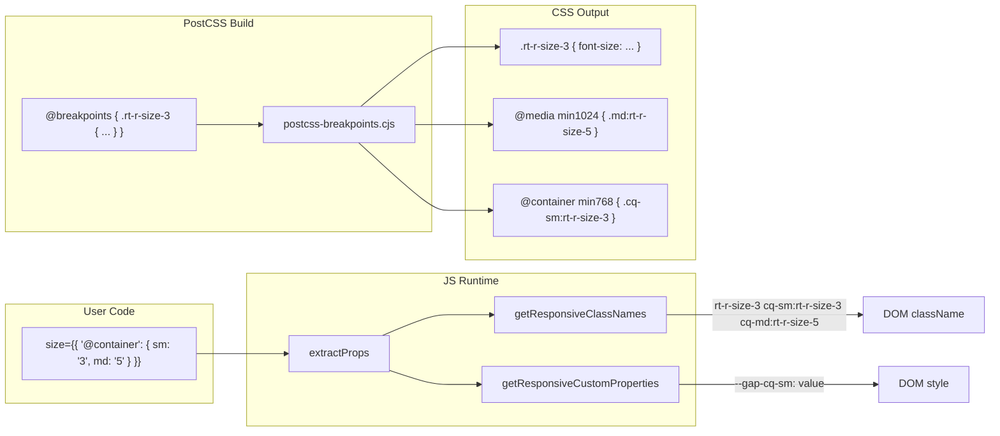

# Container Query Support for Responsive Props

## Feasibility Assessment

The proposed API **works well** for unnamed container queries. Key reasons:

- The `@container` key coexists with breakpoint keys (`initial`, `md`, etc.) in the responsive object. Existing code in `getResponsiveClassNames` already skips unknown keys via the `breakpoints.has(bp)` guard, so adding `@container` is non-breaking.
- The pattern maps cleanly to CSS: the same breakpoint size values (`xs`/`sm`/`md`/`lg`/`xl`) reuse the existing widths from `breakpoints.css` but inside `@container` queries instead of `@media` queries.
- `initial` is **not required** when using `@container` — components already have implicit default values from their prop defs, so `{ "@container": { sm: "3" } }` is a valid responsive value on its own.
- `initial` is excluded from container query breakpoints — it has no meaningful container query equivalent (the base style already applies everywhere).

### Simplified API (unnamed only)

```tsx
// Container queries with explicit initial value
<Heading
	size={{
		initial: "3",
		md: "5",
		"@container": {
			sm: "3",
			md: "5",
		},
	}}
/>

// Container queries only — initial is implicit from the prop default
<Heading
	size={{
		"@container": {
			sm: "3",
			md: "5",
		},
	}}
/>
```

### Naming convention (classes and custom properties)

Both class names and custom properties use a consistent `cq-` prefix for container queries:

- Media class: `sm:rt-r-size-3` (existing)
- Container class: `cq-sm:rt-r-size-3` (new)
- In CSS selectors: `.cq-sm\:rt-r-size-3` (no special escaping needed)
- Media custom property: `--gap-sm` (existing)
- Container custom property: `--gap-cq-sm` (new)

---

## Implementation

### 0. Baseline CSS capture

Before making any changes, build the library and save the current CSS output files. These will be diffed against the final build output to verify that the **only** CSS differences are the addition of container query rules. No existing rules should change.

### 1. Type system — [prop-def.ts](packages/radix-ui-themes/src/props/prop-def.ts)

Extend `Responsive<T>` to accept an optional `@container` key:

```typescript
type ContainerResponsive<T> = Partial<Record<Exclude<Breakpoint, 'initial'>, T>>;

type Responsive<T> =
  | T
  | (Partial<Record<Breakpoint, T>> & {
      '@container'?: ContainerResponsive<T>;
    });
```

Update `GetPropDefType` accordingly so that responsive prop defs expose the container query option in their inferred types.

### 2. Runtime helpers — [get-responsive-styles.ts](packages/radix-ui-themes/src/helpers/get-responsive-styles.ts)

`**isResponsiveObject**` ([is-responsive-object.ts](packages/radix-ui-themes/src/helpers/is-responsive-object.ts)): **Must be updated** to also detect the `@container` key as a valid responsive object marker. Currently it only checks for breakpoint keys. Without this change, `{ "@container": { sm: "3" } }` (without `initial` or any breakpoint key) would return `false` and the value would be treated as a plain string.

```typescript
export function isResponsiveObject<Value extends string>(
  obj: Responsive<Value | Omit<string, Value>> | undefined,
): obj is Record<Breakpoint, string> {
  return (
    typeof obj === 'object' &&
    obj !== null &&
    Object.keys(obj).some((key) => {
      return breakpoints.has(key as any) || key === '@container';
    })
  );
}
```

`**getResponsiveClassNames**`: After the existing breakpoint loop, check for `@container` key. If present, iterate its entries and generate class names with the `cq-bp:` prefix:

```typescript
const containerValue = (object as any)['@container'];
if (containerValue && typeof containerValue === 'object') {
  for (const bp in containerValue) {
    if (!hasOwnProperty(containerValue, bp) || !breakpoints.has(bp) || bp === 'initial') continue;
    const val = containerValue[bp];
    if (val !== undefined && propValues.includes(val)) {
      const baseClassName = getBaseClassName(className, val, parseValue);
      classNames.push(`cq-${bp}:${baseClassName}`);
    } else if (allowArbitraryValues && val !== undefined) {
      classNames.push(`cq-${bp}:${className}`);
    }
  }
}
```

`**getResponsiveCustomProperties**`: Same pattern — for `@container` entries, generate custom properties with the `cq` infix: `--gap-cq-sm` instead of `--gap-sm`.

**[extract-props.ts](packages/radix-ui-themes/src/helpers/extract-props.ts)**: The existing extraction logic calls `getResponsiveClassNames` / `getResponsiveStyles` which will handle `@container` automatically once updated. The code that applies prop def defaults only reads `value.initial`, so the `@container` sub-object passes through untouched.

### 3. PostCSS plugin — [postcss-breakpoints.cjs](packages/radix-ui-themes/postcss-breakpoints.cjs)

Extend the existing `@breakpoints` directive so that for each rule, it generates **both** media query and container query variants:

- **Media (existing)**: `.sm\:rt-r-display-flex` inside `@media (min-width: 768px)`
- **Container (new)**: `.cq-sm\:rt-r-display-flex` inside `@container (min-width: 768px)`

**Container query at-rules are placed after all media query at-rules** to ensure they take precedence in the cascade when both apply.

The `addPrefix` function needs a new mode for container queries that prepends `cq-bp\:` instead of `bp\:`. The regex `/\.(-?rt-r-[a-z0-9-]+)/g` stays the same; only the replacement string changes.

For each breakpoint, after adding the media query clone, also add a container query clone:

```javascript
breakpoints.forEach((breakpoint) => {
  // Media query variant (existing)
  const mediaClone = originalRule.clone();
  addPrefix(mediaClone, breakpoint.name);
  cache.get(breakpointsRule).media[breakpoint.name].append(mediaClone);

  // Container query variant (new)
  const containerClone = originalRule.clone();
  addPrefix(containerClone, `cq-${breakpoint.name}`);
  cache.get(breakpointsRule).container[breakpoint.name].append(containerClone);
});
```

Container query `@container` at-rules use `(min-width: Xpx)` with the same pixel values as the media queries (520, 768, 1024, 1280, 1640). These are read from `breakpoints.css` and the plugin already has them parsed; we just use the raw `params` values.

**Output ordering:**

1. Base rules (no query, moved before `@breakpoints`)
2. `@media` at-rules (existing, in breakpoint order: xs, sm, md, lg, xl)
3. `@container` at-rules (new, in breakpoint order: xs, sm, md, lg, xl)

### 4. Arbitrary value CSS

Currently, arbitrary value rules are **manually written** outside `@breakpoints` (e.g., `gap.css` lines 103-166 have hand-written `@media (--sm) { .sm\:rt-r-gap { gap: var(--gap-sm); } }`).

For container queries, equivalent rules are needed:

```css
@container (min-width: 768px) {
  .cq-sm\:rt-r-gap {
    gap: var(--gap-cq-sm);
  }
}
```

**Approach**: Manually add the container query blocks to the ~23 utility CSS files that have arbitrary value rules. Container query blocks are placed **after** the existing media query blocks in each file. Deduplication via a PostCSS directive can be explored later.

**Files requiring manual container query blocks** (23 utility files + 1 component file):

- `src/styles/utilities/flex-basis.css`
- `src/styles/utilities/flex-grow.css`
- `src/styles/utilities/flex-shrink.css`
- `src/styles/utilities/gap.css`
- `src/styles/utilities/grid-area.css`
- `src/styles/utilities/grid-column.css`
- `src/styles/utilities/grid-column-end.css`
- `src/styles/utilities/grid-column-start.css`
- `src/styles/utilities/grid-row.css`
- `src/styles/utilities/grid-row-end.css`
- `src/styles/utilities/grid-row-start.css`
- `src/styles/utilities/grid-template-areas.css`
- `src/styles/utilities/grid-template-columns.css`
- `src/styles/utilities/grid-template-rows.css`
- `src/styles/utilities/height.css`
- `src/styles/utilities/inset.css`
- `src/styles/utilities/margin.css`
- `src/styles/utilities/max-height.css`
- `src/styles/utilities/max-width.css`
- `src/styles/utilities/min-height.css`
- `src/styles/utilities/min-width.css`
- `src/styles/utilities/padding.css`
- `src/styles/utilities/width.css`
- `src/components/theme-panel.css` (if applicable)

### 5. Container definition props

**New shared prop defs** (new file `packages/radix-ui-themes/src/props/container.props.ts`):

```typescript
const containerTypeValues = ['inline-size', 'size', 'normal'] as const;

const containerPropDefs = {
  containerType: {
    type: 'enum',
    className: 'rt-r-container-type',
    values: containerTypeValues,
  },
  containerName: {
    type: 'string',
    className: 'rt-r-container-name',
    customProperties: ['--container-name'],
  },
};
```

Add `containerPropDefs` to **all non-typography components**. Typography components (Blockquote, Code, Em, Heading, Kbd, Link, Quote, Strong, Text) are excluded because they are inline/text-level elements where container definition doesn't make semantic sense.

**Non-typography components receiving container props** (41 components):

- AlertDialog, Avatar, Badge, Box, Button, Callout, Card, Checkbox, CheckboxCards, CheckboxGroup, Container, ContextMenu, DataList, Dialog, DropdownMenu, Flex, Grid, HoverCard, IconButton, Inset, Popover, Progress, Radio, RadioCards, RadioGroup, ScrollArea, SegmentedControl, Section, Select, Separator, Skeleton, Slider, Spinner, Switch, TabNav, Table, Tabs, TextArea, TextField, Theme, Tooltip

For each component:

1. Import `containerPropDefs` in the `.props.tsx` file
2. Spread into the component's prop defs
3. Pass to `extractProps()` in the `.tsx` file

### 6. Container CSS utilities

New CSS file `packages/radix-ui-themes/src/styles/utilities/container.css`:

```css
@breakpoints {
  .rt-r-container-type-inline-size {
    container-type: inline-size;
  }
  .rt-r-container-type-size {
    container-type: size;
  }
  .rt-r-container-type-normal {
    container-type: normal;
  }
}

.rt-r-container-name {
  container-name: var(--container-name);
}
```

This file would be imported into the utilities index.

### 7. CSS size impact

Adding container query variants roughly doubles the CSS for responsive properties (~83% increase). This is acceptable for an initial implementation since:

- CSS compresses well (repetitive patterns)
- Users who don't use container queries pay a small cost in transfer size but zero runtime cost

If size becomes a concern, we can later split container query CSS into a separate optional file (`container-queries.css`).

---

## Testing Strategy

### Priority 1: CSS diff verification

1. Build the library **before** any changes and save all CSS output files as a baseline
2. After all implementation changes, build again
3. Diff every output CSS file against the baseline
4. **Acceptance criteria**: The only differences should be the addition of `@container` at-rule blocks and container-related utility classes. All pre-existing CSS rules must be byte-identical in the new output. No reordering, no changes to media query rules, no changes to base rules.

### Priority 2: Playground & snapshots

1. Add container query examples to playground test pages (e.g., a Box with `containerType="inline-size"` containing children with `@container` responsive props)
2. Run Playwright visual regression tests at various viewport sizes
3. Capture and commit new snapshots for the container query test pages

---

## Data flow diagram



---

## Files to modify (summary)

### Core infrastructure

- **[packages/radix-ui-themes/src/props/prop-def.ts](packages/radix-ui-themes/src/props/prop-def.ts)** — Extend `Responsive<T>` type with `@container`
- **[packages/radix-ui-themes/src/helpers/is-responsive-object.ts](packages/radix-ui-themes/src/helpers/is-responsive-object.ts)** — Detect `@container` key as valid responsive object
- **[packages/radix-ui-themes/src/helpers/get-responsive-styles.ts](packages/radix-ui-themes/src/helpers/get-responsive-styles.ts)** — Handle `@container` in class name and custom property generation
- **[packages/radix-ui-themes/src/helpers/extract-props.ts](packages/radix-ui-themes/src/helpers/extract-props.ts)** — Verify `@container` values pass through correctly
- **[packages/radix-ui-themes/postcss-breakpoints.cjs](packages/radix-ui-themes/postcss-breakpoints.cjs)** — Generate container query variants after media query variants

### New files

- `**packages/radix-ui-themes/src/props/container.props.ts**` — Container definition prop defs
- `**packages/radix-ui-themes/src/styles/utilities/container.css**` — Container utility classes

### Component props & implementations (41 non-typography components)

- Each component's `.props.tsx` — Import and spread `containerPropDefs`
- Each component's `.tsx` — Pass `containerPropDefs` to `extractProps()`

### Arbitrary value CSS (24 files)

- 23 utility CSS files + `theme-panel.css` — Manually add `@container` query blocks after existing `@media` blocks to avoid over-complicating the plugin for now.
